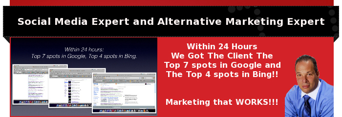

## Social Media

## Think: location, location,location!

This phrase’s first documented use was in June, 1956. For generations, we have used this mantra when selecting the best spot to set up our business. We made our choice based upon foot traffic, proximity to major roads and visibility to potential clients. Our marketing campaigns were built around our physical address.

## Same song, different dance.

In today’s world, it’s still “location, location, location”. The difference is everyone is on a Social Media Network, Facebook, Twitter…..  Just like your physical office is a direct reflection of you, your Social Media Marketing is also a reflection of you.

## What is Social Media Marketing and Why?

Simply put, Social Media Marketing is the process required to get your business noticed on the Social Media Networks that everyone is on.. Previously, you may have used traditional advertising (newspaper, direct mail, radio and tv spots, or telemarketing). In the Social Media world, clients look on Facebook, Linkedln, Twitter and more for resources..

Simply having a website is not enough. If your current and prospective clients can’t find you on the web, what is the point of having a site?

## Can your clients find you?  I can help.


